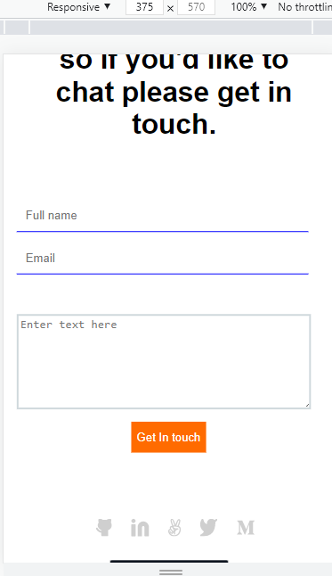
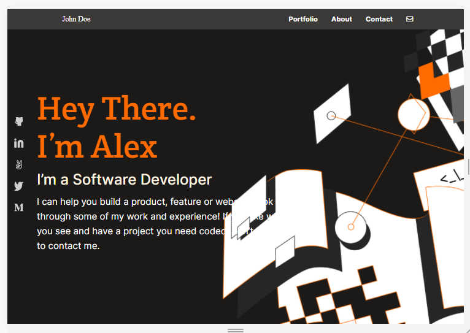
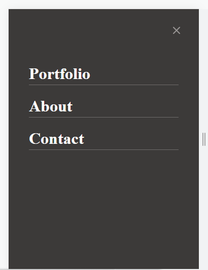

# My-Logo

This is my Second prject titled My Portfolio using HTML5 and CSS3 only.

# live Demo link
[live demo link](https://gentilitysp.github.io/My-Porfolio/)

## The following are some of the features of this project:

1. Has a Nav bar
2. Has a Header
3. Has a background image
4. Has a body
5. footer
6. text arear

## Built With

- HTML5
- CSS3

## Getting Started 

For one to get started, just clone the repository and open index html file in your browser.

## Author

 **Ugbordiegwu Chimaijem S.**
 **Engr. Gentility**

- Github: [Gentilitysp](https://github.com/Gentilitysp)
- Twitter:[@chimaijemeze](https://twitter.com/ChimaijemEze)
- Linkedin: [Chimaijem Eze](https://www.linkedin.com/in/chimaijem-eze-585530134/)
- Email: chimaijemeze@gmail.com

# 🤝 Contributing
Contributions, issues, and feature requests are welcome!

Feel free to check the issues page.

## Show your support
Give a ⭐️ if you like this project!

## Acknowledgments
Hat tip to Microverse github template
## 📝 License
This project is MIT licensed.